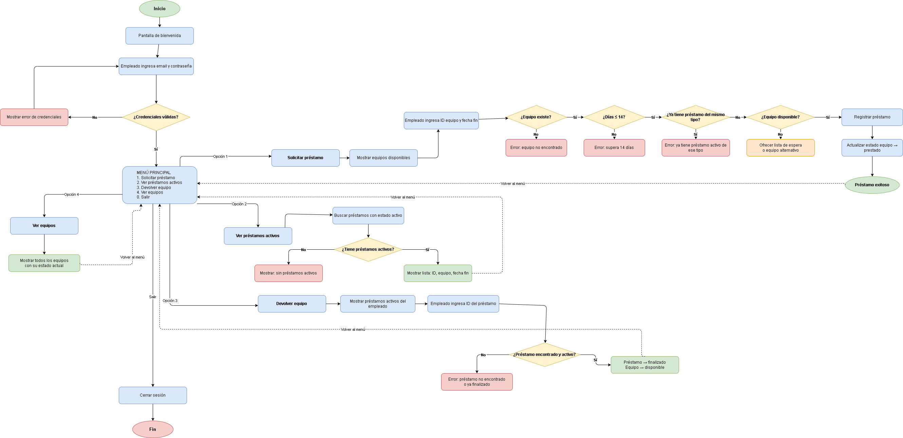

# Sistema de Préstamo de Equipos de TI 

Sistema interno para que los empleados puedan solicitar en préstamo equipos de TI (Laptops, Monitores, Tablets) por periodos de hasta un máximo de 14 días.

---

## Fase de Análisis

### Entidades Principales

#### 1. Usuario
| Atributo | Descripción |
|---|---|
| `id_usuario` | Identificador único (ej. USR-001) |
| `nombre` | Nombre completo del empleado |
| `email` | Correo corporativo |
| `cargo` | Cargo dentro de la empresa |
| `password` | Contraseña de acceso al sistema |

#### 2. Equipo
| Atributo | Descripción |
|---|---|
| `id_equipo` | Identificador único (ej. EQ-001) |
| `tipo` | Tipo de equipo (Laptop, Monitor, Tablet) |
| `marca` | Marca del equipo |
| `modelo` | Modelo específico |
| `estado` | Estado actual (disponible, prestado, en mantenimiento) |

#### 3. Préstamo
| Atributo | Descripción |
|---|---|
| `id_prestamo` | Identificador único (ej. PR-001) |
| `id_usuario` | Referencia al usuario que solicita |
| `id_equipo` | Referencia al equipo solicitado |
| `fecha_inicio` | Fecha en que se realiza el préstamo (automática) |
| `fecha_fin` | Fecha de devolución pactada |
| `estado` | Estado del préstamo (activo, finalizado, cancelado) |

#### 4. Lista de Espera
| Atributo | Descripción |
|---|---|
| `id_usuario` | Referencia al usuario en espera |
| `id_equipo` | Equipo que está esperando |
| `fecha_solicitud` | Fecha en que se unió a la espera |
| `fecha_fin_deseada` | Fecha hasta cuando lo necesita |
| `estado` | Estado (esperando, notificado, cancelado) |

---

### Reglas de Negocio

1. El préstamo máximo es de **14 días**.
2. La **fecha de inicio** se asigna automáticamente con la fecha actual del sistema.
3. Si el equipo solicitado está prestado, el sistema ofrece al usuario dos opciones: unirse a la **lista de espera** o elegir un **equipo alternativo disponible del mismo tipo**.
4. Un usuario **no puede tener dos préstamos activos del mismo tipo** de equipo al mismo tiempo.
5. No se puede prestar un equipo con estado **"en mantenimiento"** o **"prestado"**.
6. La fecha de fin **no puede ser anterior** a la fecha de inicio.

---

## Fase de Síntesis — Diagrama de Flujo



---

## Fase de Pensamiento Sistémico — Escenarios No Ideales

---

### Escenario 1 — Concurrencia: dos empleados piden el mismo equipo al mismo tiempo

**¿Qué pasa?**
Si dos empleados solicitan el mismo equipo exactamente al mismo tiempo, ambos podrían ver el equipo como "disponible" y el segundo podría registrar un préstamo sobre un equipo que ya fue asignado al primero.

**¿Cómo debería reaccionar el sistema?**
El sistema debería implementar un mecanismo de bloqueo (lock) sobre el archivo de datos al momento de registrar un préstamo. Solo un proceso podría escribir a la vez. El segundo usuario recibiría la respuesta de que el equipo ya no está disponible y se le ofrecerían las alternativas correspondientes.

---

### Escenario 2 — Archivos JSON corruptos o inexistentes

**¿Qué pasa?**
Si alguno de los archivos de datos (`equipos.json`, `prestamos.json`, etc.) se corrompe o es eliminado accidentalmente, el sistema lanzaría un error no controlado y se detendría abruptamente.

**¿Cómo debería reaccionar el sistema?**
El sistema debería validar la existencia e integridad de los archivos JSON al iniciar. Si alguno no existe, debería crearlo vacío automáticamente. Si está corrupto, debería mostrar un mensaje claro al administrador indicando cuál archivo tiene el problema, sin detener todo el sistema.

---

### Escenario 3 — Datos con formato incorrecto ingresados por el usuario

**¿Qué pasa?**
Si el usuario ingresa una fecha en formato incorrecto (ej. `32/13/2026`) o un ID de equipo que no sigue el formato esperado (ej. `eq001` en vez de `EQ-001`), el sistema podría fallar al intentar procesar esos datos.

**¿Cómo debería reaccionar el sistema?**
El sistema debería validar cada entrada del usuario antes de procesarla. Si el formato es incorrecto, debería mostrar un mensaje claro indicando el formato esperado y volver a pedir el dato sin interrumpir el flujo del programa. Actualmente el sistema ya valida el formato de fechas mediante la función `parsear_fecha()`.

---

## Implementación

### Tecnologías utilizadas

- **Lenguaje:** Python 3.13
- **Persistencia:** Archivos JSON
- **Librerías externas:** `tabulate` (visualización de tablas en consola)

### Estructura del proyecto

```
sistema_prestamos/
│
├── data/
│   ├── usuarios.json
│   ├── equipos.json
│   ├── prestamos.json
│   └── lista_espera.json
│
├── design/
│   ├── menu.py
│   └── empleado.py
│
├── logic/
│   ├── prestamos.py
│   ├── equipos.py
│   └── usuarios.py
│
├── formula/
│   └── validaciones.py
│
├── general.py
├── main.py
├── .gitignore
└── README.md
```
## Arquitectura del sistema

El proyecto está dividido en capas:

- **data/** — archivos JSON que simulan la base de datos
- **logic/** — lógica de negocio (usuarios, equipos, préstamos, lista de espera)
- **formula/** — validaciones de fechas
- **design/** — interacción con el usuario (menús y consola)


### Cómo ejecutar

1. Instala la dependencia necesaria:
```bash
pip install tabulate
```

2. Ejecuta el sistema:
```bash
python main.py
```

3. Usa las siguientes credenciales de prueba:

| Email | Contraseña |
|---|---|
| carlos.ramirez@empresa.com | 1234 |
| laura.gomez@empresa.com | 1234 |
| andres.torres@empresa.com | 1234 |

---